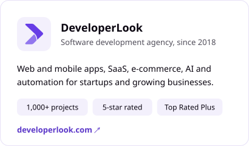
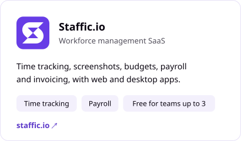
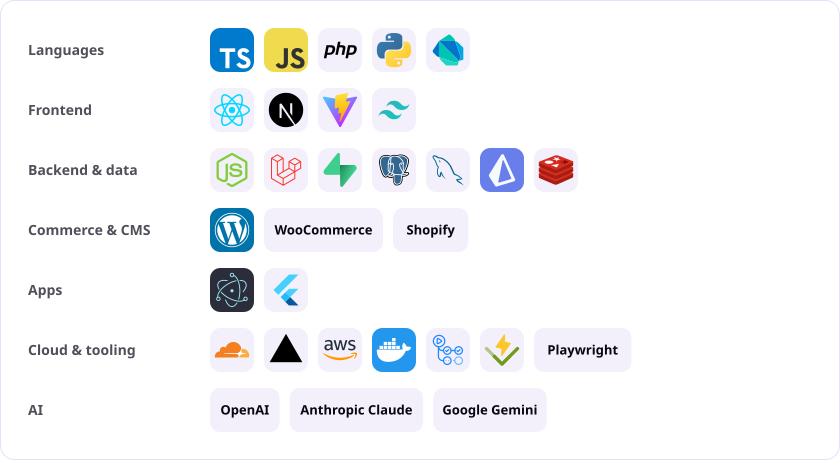

<!-- Charts below are regenerated daily by .github/workflows/profile-stats.yml -->

<a href="https://developerlook.com">
  <picture>
    <source media="(prefers-color-scheme: dark)" srcset="assets/hero-dark.svg">
    
  </picture>
</a>

  
  
  
  
  

## About

I'm the founder and CEO of [DeveloperLook](https://developerlook.com). Since 2018 my team and I have shipped 1,000+ projects for founders across the US, UK, Canada, Australia and Singapore. I also built [Staffic.io](https://staffic.io), a workforce management SaaS.

> Most businesses don't have a technology problem. They have an operations problem that the right systems can solve.

**What I build**

- SaaS products and MVPs
- Web apps and internal tools that replace manual work
- AI integrations and automation: agents, chatbots and workflows
- Shopify apps and themes, WordPress and WooCommerce plugins

After rebuilding DeveloperLook's own operations with automation and internal tools, my productivity went to 2.5x.

## What I'm building

  <a href="https://developerlook.com"><picture><source media="(prefers-color-scheme: dark)" srcset="assets/card-developerlook-dark.svg"></picture></a>
  <a href="https://staffic.io"><picture><source media="(prefers-color-scheme: dark)" srcset="assets/card-staffic-dark.svg"></picture></a>

Browse 100+ projects in the [DeveloperLook portfolio](https://developerlook.com/portfolio).

## Tech stack

<picture>
  <source media="(prefers-color-scheme: dark)" srcset="assets/stack-dark.svg">
  
</picture>

## GitHub activity

Most of my work lives in private client repositories. These charts are generated from my full activity by a GitHub Action in this repo and refresh daily. They show totals only: no private code, project or client names.

<picture>
  <source media="(prefers-color-scheme: dark)" srcset="https://raw.githubusercontent.com/saimulft/saimulft/output/overview-dark.svg">
  
</picture>

<picture>
  <source media="(prefers-color-scheme: dark)" srcset="https://raw.githubusercontent.com/saimulft/saimulft/output/activity-dark.svg">
  
</picture>

  <picture><source media="(prefers-color-scheme: dark)" srcset="https://raw.githubusercontent.com/saimulft/saimulft/output/languages-dark.svg"></picture>
  <picture><source media="(prefers-color-scheme: dark)" srcset="https://raw.githubusercontent.com/saimulft/saimulft/output/rhythm-dark.svg"></picture>

<picture>
  <source media="(prefers-color-scheme: dark)" srcset="https://raw.githubusercontent.com/saimulft/saimulft/output/snake-dark.svg">
  
</picture>

<a href="https://github.com/saimulft/saimulft/blob/output/stats.md">View these numbers as tables</a>

## Let's work together

If your business is growing but your operations haven't kept up, that's the conversation I want to have.

  <a href="https://developerlook.com/contact"><picture><source media="(prefers-color-scheme: dark)" srcset="assets/btn-start-dark.svg"></picture></a>
  <a href="mailto:saimulft@gmail.com"><picture><source media="(prefers-color-scheme: dark)" srcset="assets/btn-email-dark.svg"></picture></a>

